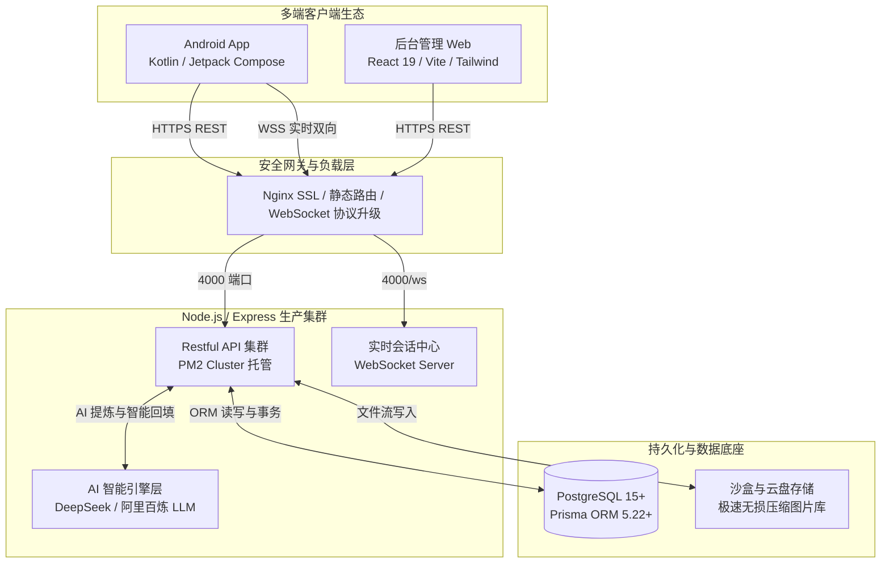
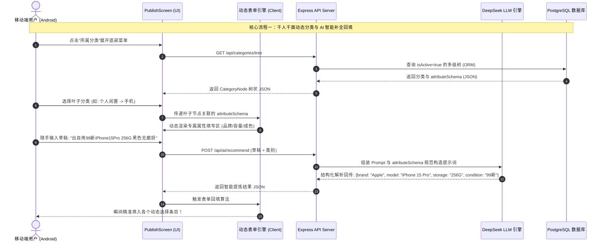
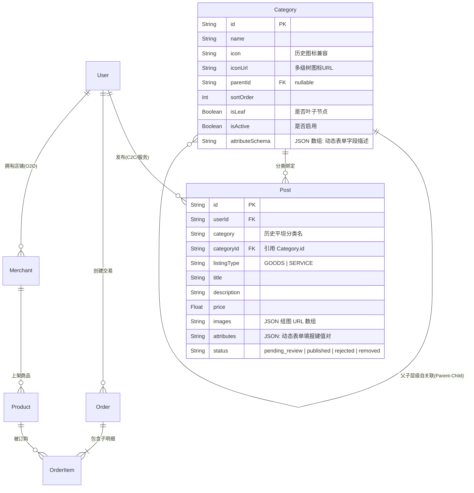

# 同城清远 (LsLife) - V2.2 全栈研发架构、智能算法与运维部署交接白皮书

> [!IMPORTANT]
> 本白皮书是《同城清远 (LsLife)》从 V1.x 演进至 **V2.2 生产级真正前后端分离架构** 的权威技术交接与架构总纲。
> 文档系统梳理了多端体系结构、技术选型、智能核心算法、自动化 DevOps 流水线以及底座数据库模型，是参与后续二次开发的架构师、前端开发、后端工程、DBA 及运维人员的强制参考标准与指引。

---

## 1. 🌐 项目定位与四大业务闭环

《同城清远 (LsLife)》是一个立足于广东清远壮族瑶族自治县的**县域 O2O 本地生活服务与 C2C 社区交易综合商业平台**。系统围绕县域生活脉络，打通了四大核心闭环：



1. **商家 O2O 外卖与配送闭环**：商家店铺展示、多规格商品浏览、智能推荐排位、购物车校验、订单生成、全生命周期交易与实时配送轨迹追查。
2. **同城动态与闲置综合信息流 C2C 闭环（1:1 闲鱼高精度复刻）**：搭载**多级层级树状分类体系**（个人闲置、招聘求职、房屋租售、家政保洁、农副土特产）、**千人千面动态表单引擎**、**Cache-on-Select (选定即落盘) 沙盒安全流转**、**多核并行图像视觉无损压缩** 以及 **LLM 智能草稿提炼与一键回填**。
3. **即时通讯 (IM) 与社交连接闭环**：基于底层原声 WebSocket 搭建的会话房间控制中心，支持买卖双方实时在线洽谈、心跳保活与离线消息同步。
4. **后台风控审计与全局配置闭环**：全栈用户画像与权限管理、商家入驻审批、动态发布审核、动态分类 Schema 表单实时配置。

---

## 2. 🎨 品牌视觉与设计系统美学 (Design System)

系统摒弃了早期粗糙的原型 UI，在 V2.0-V2.2 期间确立了顶级现代化移动端设计系统：
* **核心调性**：以 **乳白色 (Milk White #F7F8FA / #FFFFFF)** 为沉稳质感基底，配合 **鲜红色 (Bright Red #E53935 / #D32F2F)** 为视觉引导与交互焦点，实现了“3D 扁平化、简约大方、匀称清爽”的程序语言与全新的红色心形提手门图标 (`LsLife_Icon.png`)。
* **深浅主题驱动**：深入适配了系统级的浅色 (Light) / 深色 (Dark) 动态切换；卡片加载广泛采用骨架屏 (Skeleton Card) 与 Shimmer 微动效，配合下拉刷新 (Pull-to-Refresh) 带来极其流畅的物理触觉体验。

---

## 3. 🛠️ 多端架构与技术选型白皮书 (Tech Stack)

### 3.1 Android 移动端 (Frontend - Mobile App)
* **核心语言**：**Kotlin 1.9+** (全库 100% Kotlin 编写)。
* **UI 框架**：**Jetpack Compose** (声明式 UI，严格执行 Material 3 组件规范)。
* **架构模式**：**MVVM + SSOT (Single Source of Truth) + Repository Pattern**。所有视图层仅观察由 Repository 通过 Flow 暴露出的一致状态，杜绝多源数据冲突。
* **依赖注入**：**Dagger Hilt** (`@HiltViewModel`, `@Inject`, `@Singleton`) 实现全模块服务注入。
* **响应式编程**：**Kotlin Coroutines & Flow (`StateFlow`, `SharedFlow`, `Channel`)** 处理异步事件、网络回调与 UI 状态驱动。
* **网络通讯**：**Retrofit 2 + OkHttp 3 + Kotlinx Serialization**。
  > [!WARNING]
  > **混淆安全规范**：Android 客户端已配置严谨的 ProGuard / R8 混淆规则，确保对 `ApiEnvelope<T>`、`CategoryNode` 等核心序列化数据模型的反射解析绝不因 Release 混淆而发生结构错位或闪退。
* **图像管道**：**Coil** 配合原声 `BitmapFactory` 与 `File` 沙盒操作。
* **构建系统**：Gradle 8.x KTS，内嵌自动化编译与版本累加引擎（当前稳定生产版本号：**v2.2**, `versionCode=13`）。

### 3.2 后台管理端 (Admin Web Dashboard)
* **核心框架**：**React 19 + TypeScript + Vite**。
* **路由与交互**：React Router Dom 实现 SPA 架构；**TailwindCSS 3.x + Lucide Icons + Radix UI** 构建响应式现代界面。
* **网络请求**：Axios 拦截器封装，实现与服务端的 JWT 自动续期与全局鉴权拦截。

### 3.3 生产级后端服务底座 (Backend Server)
* **运行环境**：**Node.js (v20+) / TypeScript / ES Modules (`type: "module"`)**。
* **Web 框架**：**Express 4.21+**。全部路由采用 Restful 规范，经过 `Zod` 进行严格的入参 Schema 校验，通过封装 `asyncHandler` 与 `ApiError` 保证任何未知异常均能优雅降级输出标准 HTTP JSON 包装格式。
* **实时即时通讯引擎**：**原生 `ws` (WebSocket Server)** 搭建于端口 4000 (`src/realtime/hub.ts`)，维护在在线客户端会话映射表，提供在线通知、会话消息分发与心跳健康状态监控。
* **AI 大语言模型服务整合**：集成 **DeepSeek / 阿里百炼 (DashScope) 合规模型 API** (`src/services/ai.ts`)。
* **安全拦截层**：**JSON Web Token (JWT)** Stateless 鉴权 + **BCrypt** 密码加密 + **Helmet** HTTP 安全头 + CORS 白名单控制。

---

## 4. 🧠 核心智能算法与底座逻辑 (Core Algorithms & Logic)



### 4.1 千人千面动态表单引擎 (Dynamic Form Engine)
为避免在客户端硬编码任何品类的表单 UI，系统构建了真正面向未来的抽象驱动机制：
* **数据驱动分类树**：底层采用 `Parent -> Children -> Leaf` 三级树状组织。
* **JSON Schema 动态解耦**：每一个叶子分类（如“手机”、“女装”、“家政日常保洁”）都在表模型 `Category.attributeSchema` 中存储独立的 JSON 描述符。例如：
  ```json
  [
    { "key": "brand", "label": "品牌", "fieldType": "SELECT", "required": true, "options": ["Apple", "小米", "华为"] },
    { "key": "storage", "label": "存储容量", "fieldType": "SELECT", "required": true, "options": ["128G", "256G", "512G"] }
  ]
  ```
* **客户端条件渲染**：Android 端解析此 Schema 后，利用 Jetpack Compose 动态构造为对应的选框面板（Pills）、下拉列表或文字输入框，实现一键水平扩充品类而无需改动一行移动端界面代码。

### 4.2 AI 自然语言提炼与自动回填算法 (LLM Parsing & Auto-Fill)
* 当用户在草稿框随机输入一大段非结构化描述后，后端 AI 服务将 `prompt` 结合当前选中分类的 `attributeSchema` 规范，构造为严格限定格式的 System Prompt 注入大语言模型。
* 模型在推理后直接抽离出规范的 JSON 键值对（如提取出具体的品牌、型号、年限），客户端收到后立即驱动 UI 表单绑定发生 state 改变，完成平滑的自动填报。

### 4.3 智能全画幅多线程图像视觉无损压缩算法 (High-Concurrency Image Compressor)
为解决移动端拍摄的高清原图（通常单图 5~15MB）触发服务器 5MB Nginx/Multer 上传上限，系统设计了强悍的底层图像处理管道：

```mermaid
graph LR
    A[相册/PhotoPicker 选择多图] -->|1. 瞬间选定| B[Cache-on-Select 机制<br/>立即读取并写入本地临时沙盒文件]
    B -->|2. 无参绝对路径流转| C[进入处理协程池<br/>Dispatchers.IO 并发发车]
    C -->|3. 二分计算| D[BitmapFactory.Options<br/>计算最佳 inSampleSize 缩放比]
    D -->|4. 智能压转| E[Bitmap.compress(JPEG, quality)<br/>动态降维至 800KB~1MB 无损质量]
    E -->|5. 并发 Multipart| F[上传后端接收端 /api/upload]
```
* **Cache-on-Select 机制**：选取图片的瞬间，立即通过 Stream 将原图写入本地沙盒临时目录 (`avatar_temp.jpg` 或 `post_temp_*.jpg`)，通过传递本地绝对路径而非 Content URI，彻底斩断 Android 13+ 跨页面权限回收及 Jetpack Navigation 路由传递复杂字符截断黑屏的顽疾。
* **携程池并发控制**：在进行多张组图压缩时，利用 Kotlin 协程并行计算，且修复了协程 `async` 中的异常击穿逃逸问题，确保单个图片转换失败绝不阻塞整个发布上传队列。

---

## 5. 🗄️ 数据库架构与 Prisma ORM 模型白皮书

底层关系型数据库采用 **PostgreSQL 15+**，搭载 **Prisma ORM 5.22+**，具备完备的级联删除、全字段类型约束及 JSONB 动态查询能力。
数据库主文件为 `backend/prisma/schema.prisma`，核心模型全景定义如下：



### 5.1 关键模型详细解密
1. **`Category`（分类与动态表单表）**：
   * `parentId`：自关联外键，`null` 代表顶级分类。
   * `isLeaf`：标识是否为终极叶子节点，只有为 `true` 的节点才会允许触发选择及解析表单。
   * `attributeSchema`：核心 JSON 文本数组字段，决定 UI 渲染规则。
2. **`Post`（同城综合信息流/发布表）**：
   * 兼具“物品买卖 (GOODS)”与“本地服务提供 (SERVICE)”两种形态 (`listingType`)。
   * `attributes`：以 JSON 格式存储用户在前端动态表单中所选择或填写的属性（如 `{"brand": "Apple", "storage": "256G"}`），从而让不同品类的记录能存放在统一的高性能分区表中。
3. **`User` 与 `Merchant`（身份隔离与关联）**：
   * 采用双重身份模型。普通账号即可在 C2C 社区发布闲置/家政服务；当需要开办专业 O2O 餐饮/外卖店时，可通过提交入驻申请绑定 `Merchant` 表，开通独立管理台与商品库 `Product`。

---

## 6. ⚙️ DevOps 生产自动化流水线与部署操作手册

生产服务器部署在公网 IP `115.191.6.95` (`lslife@115.191.6.95`)，绑定域名 `mentalhlp.site`。系统为您打造了一键极客编译部署脚本：[deploy_prod.ps1](file:///d:/LsLife/deploy_prod.ps1)。

### 6.1 自动化发布流水线全景图
当您需要在本地 Windows 开发电脑上将最新修改推送到云端生产环境时，绝对不用手动敲击繁琐的命令行，脚本自动完成以下核心逻辑：
1. **本地环境编译**：进入 `backend/` 运行 `npm run build` 生成最新 `dist/` 产物；进入 `admin-web/` 运行 `npm run build` 编译生产 React 静态资源。
2. **构建精简沙盒**：通过 Windows 极速 `robocopy` 构建本地沙盒 `deploy_tmp/`，并智能剔除 `node_modules` 与本地调试 `.env`。
3. **安全配置转换**：利用 `node -e` 正则引擎，自动将沙盒中 `schema.prisma` 里的 `sqlite` 驱动安全平滑切换为生产级 `postgresql`。
4. **加密隧道归档上传**：将整体沙盒压缩为 `release.tgz`，通过 SCP 免密隧道直接推送到远端 `/home/lslife/release.tgz`。
5. **云端自动化交付（SSH 远程钩子触发）**：
   * 自动配置远端 `PATH` 指向 `/home/lslife/.local/nodejs/bin`。
   * 解压并覆盖服务器 `lslife-backend/` 目录，执行 `npm install --production`。
   * **自动数据模式同步与种子回填**：执行 `npx prisma generate` 更新云端类型结构 -> 执行 `npx prisma db push --accept-data-loss` 将 ORM 表结构对齐至生产数据库 -> **执行 `npx -y tsx prisma/seed.ts` 自动检验并灌入最新分类树与表单 Schema 种子数据**！
   * 执行 `pm2 restart all` 零闪断重启 Node 业务集群。
   * 通过 `sudo -S cp -r /home/lslife/release_tmp/admin-web-dist/* /var/www/html/admin-web/` 物理全量覆盖线上 Web 管理后台目录。

### 6.2 运维操作指南 (How-To)
* **发布生产环境**（在工作区根目录 PowerShell 执行）：
  ```powershell
  powershell -ExecutionPolicy Bypass -File .\deploy_prod.ps1
  ```
* **更新本地开发数据库与种子数据**（本地调试用）：
  ```powershell
  cd d:\LsLife\backend
  npx prisma db push
  npm run seed
  ```
* **手动编译安卓 Release APK 并累加版本号**：
  ```powershell
  cd d:\LsLife\android
  $env:JAVA_HOME = "C:\Program Files\Android\Android Studio\jbr"
  .\gradlew.bat assembleRelease
  ```
  *(注：编译完成后，最新版安装包会立即同步在根目录下：`d:\LsLife\app-release.apk` 与 `d:\LsLife\releases\` 中)*

---

## 7. 🤝 留给二次开发工程团队的特殊建议与底线规约

为了保障《同城清远》在高速演进中架构不腐化、体验不掉线，接手本项目的开发工程组须严格遵守以下规约：

1. **绝对禁止硬编码界面与表单**：后续如果业务部门提出要增加新分类（如“二手车”、“二手宠物”、“当地顺风车”），**千万不要在 Jetpack Compose 中通过 `if (category == "二手车")` 硬编码写 UI**！请直接在数据库表 `Category` 或 `seed.ts` 的 `attributeSchema` JSON 数组中添加对应的描述条目，全平台的表单引擎会自动完成适配渲染。
2. **严守 Cache-on-Select 图片流转机制**：所有涉及用户相机、相册选择的高分辨率图像，**严禁使用 Jetpack Navigation 路由传递字符形式的 Content URI 或 Bitmap 序列化对象**！一定要沿用先写入临时沙盒文件、传绝对路径、协程并发压至 1MB 以内再上传的黄金准则。
3. **接口容错与宽容度强保护**：继续扩充服务端接口与 Retrofit 实体类时，必须对非必须字段保持 `.nullable().optional()` 宽容度声明（如 Kotlin 中赋予 `= null` 默认值），防止线上后端进行增量演进或字段扩展时，客户端由于 JSON 解析严苛匹配失败致使整体功能报错宕机。
4. **恪守自动化编译规则**：每一次完成 Android 客户端核心功能迭代或修复完 Bug 后，在交接前或发测前，**务必自动运行一次 `assembleRelease` 编译脚本**，确保发版安装包能够随着开发进度平稳向前累加。
